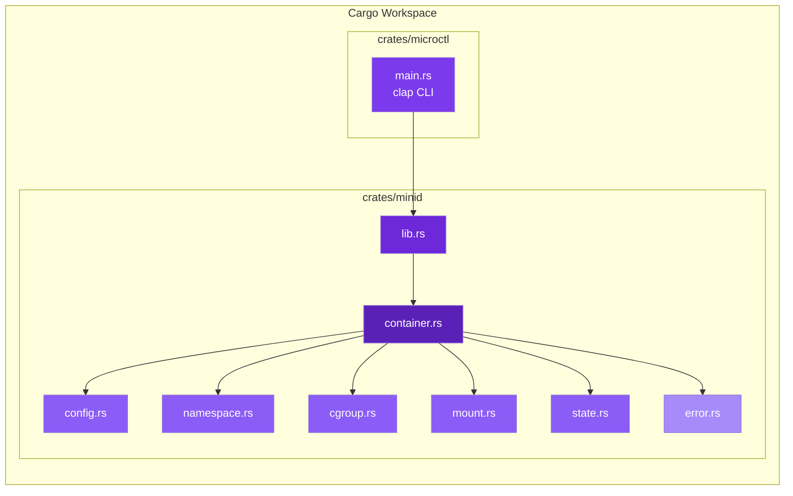
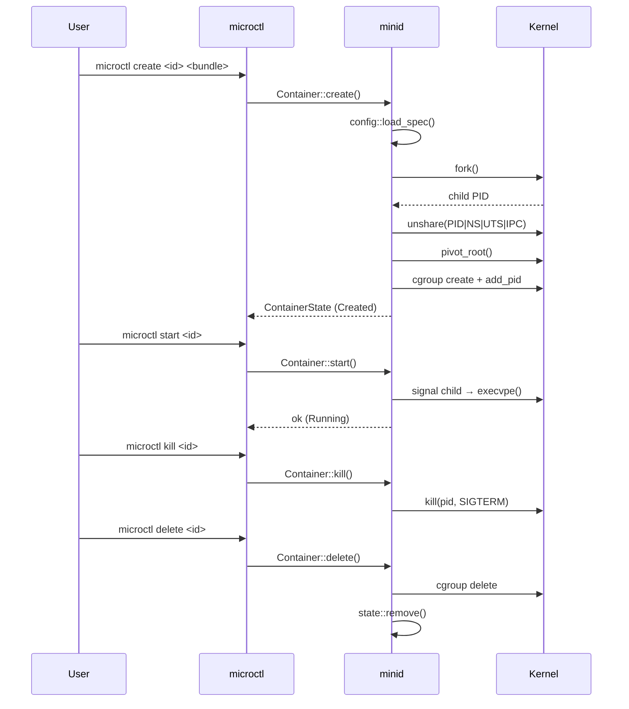
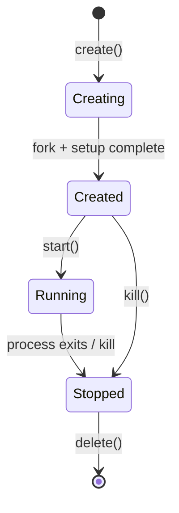

# Architecture

## Overview

**minid** is a minimal OCI-style container runtime written in Rust. It isolates
processes using Linux namespaces, controls resource usage via cgroups v2, and
follows the OCI runtime specification lifecycle.

## Crate Layout

## Data Flow

## Container Lifecycle State Machine

## State Persistence

Container state is stored as JSON at `/run/minid/<container-id>/state.json`,
following OCI conventions:

| Field | Description |
|-------|-------------|
| `ociVersion` | Spec version (`1.0.2`) |
| `id` | Container ID |
| `status` | `creating` / `created` / `running` / `stopped` |
| `pid` | Init process PID |
| `bundle` | Absolute path to the OCI bundle |
| `created` | ISO 8601 timestamp |
