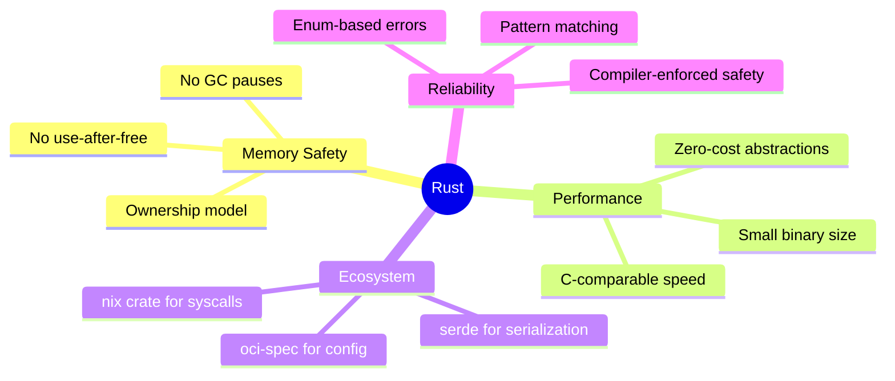
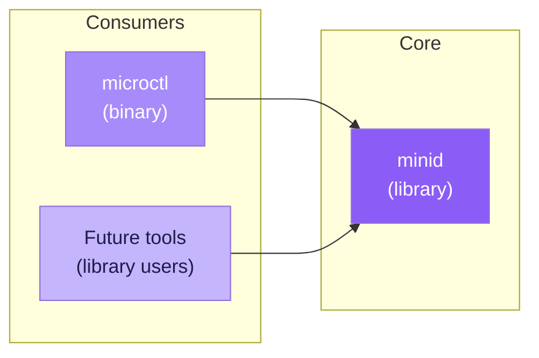
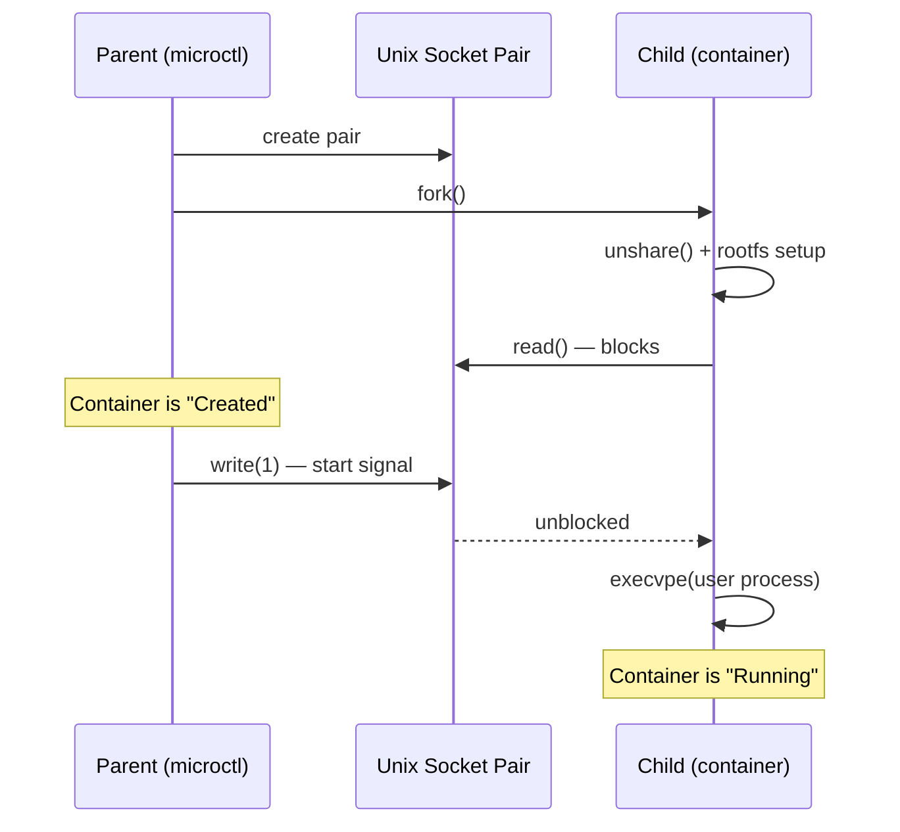

# Design Decisions

## Why Rust?

- **Memory safety without GC** — container runtimes are long-lived,
  performance-critical processes. Rust's ownership model prevents the class
  of memory bugs (use-after-free, double-free, buffer overflows) that plague
  C-based runtimes.
- **Zero-cost abstractions** — enum-based error handling, trait-based
  polymorphism, and iterators compile down to the same code you'd write in C.
- **Ecosystem** — the `nix` crate provides idiomatic, safe wrappers around
  Linux syscalls. The `oci-spec` crate handles spec parsing.

## Why a Cargo Workspace?

Splitting into `minid` (library) and `microctl` (binary) provides:

1. **Testability** — the core library can be unit-tested independently of
   the CLI.
2. **Reusability** — other tools can depend on `minid` as a library crate.
3. **Separation of concerns** — CLI argument parsing, output formatting, and
   error presentation live in `microctl`, while container logic lives in
   `minid`.

## Why cgroups v2 Only?

!!! info "cgroups v2 is the modern standard"
    All modern Linux distributions (Ubuntu 22.04+, Fedora 31+, Debian 11+)
    default to cgroups v2.

- cgroups v1 is a legacy interface with a fragmented hierarchy (one mount
  per controller). v2 uses a unified hierarchy that's simpler to manage.
- Keeping v1 support would double the cgroup code for diminishing returns.

## Why No seccomp in v1?

seccomp-bpf requires either:

- A BPF program compiled from a policy file, or
- Integration with `libseccomp` (C library with Rust bindings)

Both add significant complexity. The goal of v1 is to demonstrate core
container mechanics (namespaces, cgroups, rootfs). seccomp is the natural
next step for a v2.

## Fork vs Clone

We use `fork()` + `unshare()` rather than `clone(CLONE_NEW*)` because:

1. `nix::unistd::fork()` is a safe wrapper available on stable Rust.
2. `clone()` with namespace flags requires `unsafe` and careful stack
   management.
3. The two-step approach (fork then unshare) is easier to debug and matches
   what runc does internally.

## Socket-Based Start Synchronisation

The `create` → `start` two-phase lifecycle requires the child process to
wait after setup before exec'ing the user workload. We use a Unix socket
pair:

- **create**: parent and child each get one end. The child blocks on `read()`.
- **start**: the parent writes a byte, unblocking the child to call `exec`.

This avoids PID file race conditions and is more reliable than signal-based
synchronisation.

## State Persistence at /run/minid/

We store state under `/run/minid/<id>/state.json` because:

- `/run` is a tmpfs that's cleaned on reboot (no stale state).
- It matches the convention used by runc (`/run/runc`).
- JSON is human-readable and easy to debug.
