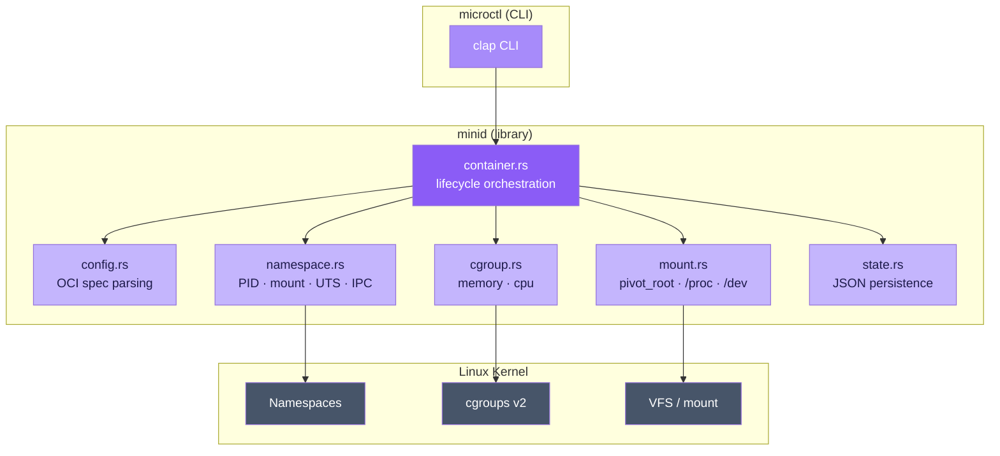

# minid

A minimal OCI-style container runtime written in Rust.

---

## What is minid?

**minid** implements the core [OCI runtime specification](https://github.com/opencontainers/runtime-spec) lifecycle operations, providing Linux process isolation through namespaces, resource control via cgroups v2, and filesystem isolation using `pivot_root`.



## Features

| Feature | Description |
|---------|-------------|
| **OCI Lifecycle** | `create` → `start` → `kill` → `delete` + `state` query |
| **Namespace Isolation** | PID, mount, UTS, IPC via `unshare(2)` |
| **cgroups v2** | Memory and CPU limits via direct filesystem writes |
| **Rootfs Pivot** | Bind-mount, `/proc` mount, `pivot_root` into the container |
| **State Persistence** | JSON state at `/run/minid/<id>/state.json` |
| **Structured Logging** | `tracing` with `RUST_LOG` env var control |

## Quick Start

```bash
# Build
make build

# Run all checks (fmt + lint + test + build)
make check

# Create and run a container (requires root + Linux)
sudo microctl create demo1 ./my-bundle
sudo microctl start demo1
sudo microctl state demo1
sudo microctl kill demo1 --signal SIGTERM
sudo microctl delete demo1
```

## Requirements

- **Linux** with cgroups v2 enabled
- **Root** privileges (namespaces, cgroups, pivot_root)
- **Rust** 1.75+
