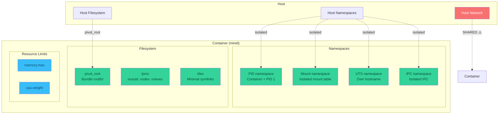

# Security Model

## Isolation Overview

## What minid Isolates

### Namespaces

| Namespace | Flag | Effect |
|-----------|------|--------|
| PID | `CLONE_NEWPID` | Container sees itself as PID 1 |
| Mount | `CLONE_NEWNS` | Isolated mount table |
| UTS | `CLONE_NEWUTS` | Isolated hostname |
| IPC | `CLONE_NEWIPC` | Isolated semaphores, message queues, shared memory |

### Filesystem Isolation

- **pivot_root**: The container's root filesystem is swapped to the bundle's
  `rootfs/` directory. The original host root is unmounted and removed from
  the container's view.
- **Bind mount**: The rootfs is bind-mounted onto itself before pivoting,
  ensuring a clean mount point.
- **/proc**: Mounted inside the container with `nosuid`, `nodev`, `noexec`.

### Resource Limits (cgroups v2)

- **Memory**: Hard limit via `memory.max`
- **CPU**: Proportional weighting via `cpu.weight`
- Cgroup directory: `/sys/fs/cgroup/minid/<container-id>/`

## What minid Does NOT Cover (v1 Scope)

!!! warning "Not Production Ready"
    These are intentionally excluded from the initial implementation to keep
    the runtime minimal and educational. They are standard features of
    production runtimes (runc, crun, youki).

| Feature | Status | Notes |
|---------|--------|-------|
| **seccomp** | ❌ | Syscall filtering |
| **AppArmor / SELinux** | ❌ | MAC policies |
| **Capabilities** | ❌ | Granular privilege control |
| **Network namespace** | ❌ | Would require veth/bridge setup |
| **User namespace** | ❌ | Rootless containers |
| **Hooks** | ❌ | prestart/poststart/poststop |
| **rlimits** | ❌ | Per-process resource limits |

## Privilege Requirements

minid requires **root** to operate because:

1. `unshare()` with PID/mount namespaces requires `CAP_SYS_ADMIN`
2. `pivot_root()` requires `CAP_SYS_ADMIN`
3. Mounting `/proc` requires `CAP_SYS_ADMIN`
4. Writing to `/sys/fs/cgroup/` requires root (or delegated cgroup ownership)

## Threat Model

!!! danger "Educational Runtime"
    This is an **educational runtime** — it should not be used to isolate
    untrusted workloads.

Key gaps:

- No syscall filtering means a containerised process can call any syscall
- No capability dropping means the container process runs with full root
  capabilities
- No network isolation means the container shares the host network stack
